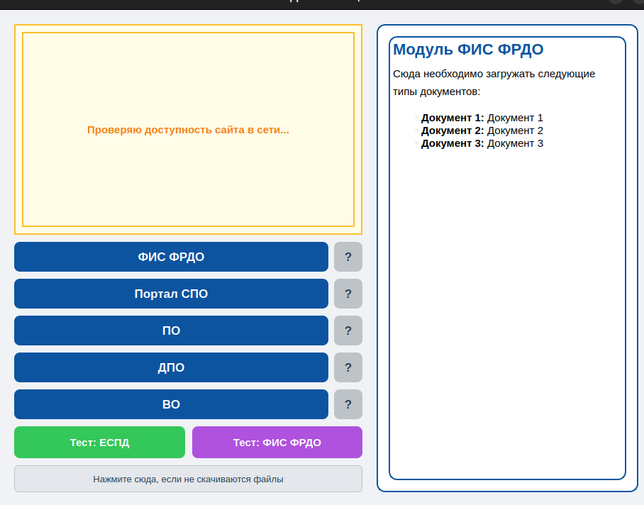

# Проект «Помощник Сети ФИС ФРДО» — Анализ проблем и решение

## Проблема

В ходе работы и анализа входящих обращений было выявлено, что **от 10% до 20% всех заявок** в техподдержку падают именно на проблемы с сетью. 

Основная часть этих проблем делится на три ключевые точки:
1. **Проблема «красного крестика» и зависаний:** Пользователь переподключил интернет, после чего сайт начинает выдавать известную ошибку «красный крестик» либо намертво зависает на моменте загрузки документов.
2. **Конфликт ViPNet и ЕСПД:** Пользователь не подключил интернет и не прошел регистрацию через ЕСПД из-за того, что у него изначально включен ViPNet. При этом обычный пользователь не понимает Линукс и банально боится что-то нажать в системе или лезть в терминал.
3. **Человеческий фактор (Куда загружать?):** В **30% случаев** пользователи вообще не знают, в какой именно модуль им нужно загружать документы. Обычно это происходит из-за отсутствия первого опыта работы с системой или когда на месте меняется ответственный сотрудник.

**Особенно актуальная ситуация:** Данные проблемы обостряются в школах, в которые съезжаются сразу несколько других учебных заведений. Они постоянно переподключают каждый свой интернет, из-за чего моментально ломается сеть (возникает Проблема №1). В итоге это каждый раз оборачивается новой заявкой или звонком в поддержку.

---

## Проект

Для решения этих проблем было создано приложение с максимально простым и автоматизированным функционалом.

### Интерфейс (UI)

Интерфейс сделан интуитивно понятным, чтобы у пользователя не возникало лишних вопросов.

### Что позволяет сделать приложение:

* **Интерактивная помощь по модулям:** Пользователь может выбрать нужный модуль ФРДО. Если он не знает, какой именно модуль ему нужен, он может нажать на знак вопроса `[ ? ]` Справа сразу может увидеть четкий список документов, которые загружаются именно в этот модуль.
* **Автоматическая настройка сети (ЕСПД + ViPNet):** При выборе модуля приложение само проверяет связь с интернетом. Если интернета нет, оно:
  1. Самостоятельно отключает ViPNet-клиент.
  2. Открывает для пользователя страницу авторизации ЕСПД.
  3. Параллельно в фоне проверяет, прошел ли пользователь регистрацию.
  4. Как только связь восстанавливается, приложение автоматически включает ViPNet обратно.
  5. Перенаправляет пользователя в браузере уже на сам целевой сайт.
* **Фоновый процесс против зависаний:** Приложение запускает фоновый процесс, который при каждом переподключении интернета будет автоматически обновлять сетевое соединение и выставлять нужные параметры. Это полностью решает проблему зависания документов и появления «красных крестиков».
